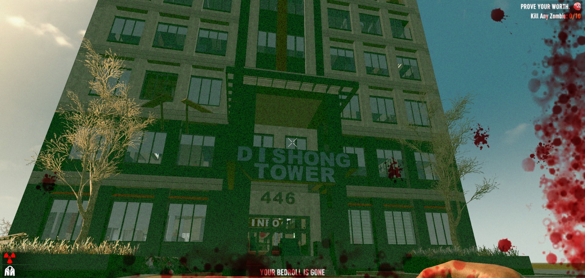

# Dishong Tower Challenge Enforcer Mod - 7 Days to Die (A20) Addon

A small harmony mod to enforce Dishong Tower Challenge Rules.

It's meant for all people that can't enforce virtual rules on their own :)
It will physically punish you for not obeying the rules as set out by the challenge!
No cheating allowed; OK, you can still enable cheat mode; but seriously, obey the rules :)

- Rules are only enforced if game world is "Dishong Tower Challenge"
  Get it from https://www.nexusmods.com/7daystodie/mods/2310
  It's important that you use that exact map for it to work
- You should spawn on the porch of the tower (new or join game/no bedroll)
- Every ground-level block is "lava" and is trader protected (no digging down)
- You can only build blocks outside the tower if 3 blocks above ground
- You can drive outside, but exiting the vehicle in the open -> lava ground
- Trader areas can also be accessed safely, if you can get there ...
- Dedicated Server support has been checked and should work (tm) 
- Only enable rules when game world is "Dishong Tower Challenge"

[![GitHub CI Compile Status][4]][3]

## Future ideas

I may code up a true "You won the challenge" event once you reach the
trader by gyrocopter and then we could also make a leader-board.
Maybe we could even have a speed-run event with these rules ;)

## Download and Install

Simply [download here from GitHub][2] and put into your A20 Mods folder:

- https://github.com/OCB7D2D/DishongTowerChallengeEnforcer/archive/master.zip (master branch)

You'll also need https://www.nexusmods.com/7daystodie/mods/2310 for the correct map.
Rules should only be applied to that specific world map, but the harmony patches will
still be applied, so for a vanilla game I recommend to disable/remove this mod in order
to make sure you don't have any additional overhead (although it should be minimal).

## Changelog

### Version 0.1.0

- Initial version

## Compatibility

I've developed and tested this Mod against version a20.6b9.

[1]: https://github.com/OCB7D2D/DishongTowerChallengeEnforcer
[2]: https://github.com/OCB7D2D/DishongTowerChallengeEnforcer/releases
[3]: https://github.com/OCB7D2D/DishongTowerChallengeEnforcer/actions/workflows/ci.yml
[4]: https://github.com/OCB7D2D/DishongTowerChallengeEnforcer/actions/workflows/ci.yml/badge.svg
